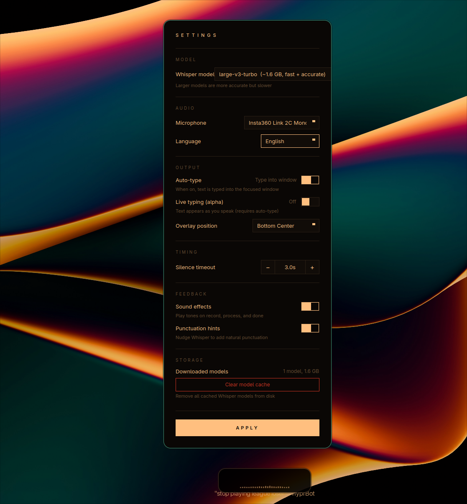

# oscribe

https://github.com/Osyna/Oscribe/raw/main/assets/showcase.mp4



Fast speech-to-text dictation for Linux with system tray integration. Powered by faster-whisper running on GPU (CUDA) or CPU.

Press a hotkey, speak, and the transcribed text is either typed into the focused window or copied to your clipboard. Works across Wayland compositors (Hyprland, Sway, KDE, GNOME) and X11.

Webiste : [https://oscribe.osyna.com/](https://oscribe.osyna.com/)

## Features

- One-hotkey dictation with automatic silence detection
- Auto-type mode: text is pasted directly into the focused window
- Clipboard mode: text is copied to the clipboard
- Punctuation hints: per-language prompts that nudge Whisper toward natural punctuation
- Live typing (alpha): streaming transcription that types words as you speak
- System tray with settings GUI
- Cross-desktop support: Wayland (Hyprland, Sway, KDE, GNOME) and X11
- Smart paste tool selection: ydotool, wtype, xdotool with per-window fallback
- GPU acceleration via CUDA, with automatic CPU fallback
- Sound effects for recording, processing, and completion states


## Prerequisites

- Python 3.10+
- [uv](https://docs.astral.sh/uv/) (recommended) or pip
- At least one paste tool for auto-type mode: `ydotool`, `wtype`, or `xdotool`
- Clipboard tools: `wl-copy` and `wl-paste` (Wayland) or `xclip`/`xsel` (X11)
- PortAudio (`libportaudio2` or equivalent)
- CUDA toolkit (optional, for GPU acceleration)

### Arch Linux

```sh
pacman -S wl-clipboard wtype ydotool portaudio
```

### Ubuntu / Debian

```sh
apt install wl-clipboard wtype ydotool libportaudio2
```

For auto-type on Wayland, `ydotool` is recommended since it works with both native Wayland and XWayland windows. `wtype` only works with native Wayland apps. On X11, `xdotool` is sufficient.


## Install

```sh
git clone <repo-url> && cd oscribe
./install.sh
```

The install script will:

1. Install `oscribe` as a tool via `uv tool install` (or `pip install --user`)
2. Detect CUDA libraries for GPU acceleration
3. Create and enable a systemd user service
4. Start the service immediately

To uninstall, run `./install.sh` again. It detects the existing install and offers to remove it.

### Manual install (without systemd)

```sh
uv tool install .          # CPU only
uv tool install .[cuda]    # with CUDA support
```

Then run `oscribe` directly to start the service.


## Usage

| Command | Description |
|---------|-------------|
| `oscribe` | Main service with system tray, listens for IPC toggle commands |
| `oscribe-trigger` | Sends a toggle signal to the running service (bind to a hotkey) |
| `oscribe-cli` | Standalone CLI with push-to-talk (no service needed) |

### Hotkey setup

Bind `oscribe-trigger` to a key in your compositor or desktop environment.

Hyprland (`hyprland.conf`):

```
bind = , F9, exec, ~/.local/bin/oscribe-trigger
```

Sway (`config`):

```
bindsym F9 exec ~/.local/bin/oscribe-trigger
```

KDE / GNOME: use the system keyboard shortcut settings to bind F9 (or any key) to `oscribe-trigger`.


## Configuration

Settings are accessible from the system tray icon. They are stored in `~/.config/oscribe/config.yaml` (or `$XDG_CONFIG_HOME/oscribe/config.yaml`) and can also be edited directly:

```yaml
device_index: null          # Microphone index (null = system default)
language: en                # Whisper language code
model: large-v3-turbo       # Whisper model (see settings GUI for options)
output_mode: clipboard      # "clipboard" or "type"
silence_timeout: 3.0        # Seconds of silence before auto-stop
window_position: bottom_center  # Overlay position on screen
sound_enabled: true         # Play feedback tones
punctuation_hints: true     # Nudge Whisper to add natural punctuation
streaming: false            # Live typing — text appears as you speak (alpha)
```

### Output modes

- **clipboard** -- Transcribed text is copied to the clipboard. The overlay window shows a checkmark when done.
- **type** -- Text is pasted directly into the previously focused window via clipboard-paste simulation. The overlay hides before pasting to avoid stealing focus.

### Punctuation hints

When enabled, a well-punctuated sentence in the configured language is passed as Whisper's `initial_prompt`. This biases the model toward producing commas, periods, and question marks. Supported languages: English, French, German, Spanish, Italian, Portuguese, Dutch, Polish, Russian, Japanese, Chinese.

### Live typing (alpha)

When enabled (requires auto-type mode), oscribe transcribes incrementally every ~1 second while you speak. Words that consecutive transcription passes agree on are typed immediately. When you stop speaking, a final pass flushes the remaining text.

This feature uses more GPU since it runs repeated inference on a growing audio window. It is disabled by default.


## Architecture

```
oscribe-trigger  --[ZMQ IPC]--> oscribe (service)
                                   |
                                   +-- AudioCapture (sounddevice)
                                   +-- Transcriber (faster-whisper)
                                   +-- DesktopHelper (clipboard, paste, focus)
                                   +-- RecordingWindow (PyQt6 overlay)
                                   +-- SettingsWindow (PyQt6 GUI)
                                   +-- SystemTrayIcon
```

- **IPC**: ZMQ REQ/REP over a Unix socket at `$XDG_RUNTIME_DIR/oscribe.ipc`
- **Audio**: captured at 16kHz mono via sounddevice, with energy-based speech detection
- **Transcription**: faster-whisper with configurable model (default `large-v3-turbo`), greedy decoding, Silero VAD filter
- **Paste simulation**: ydotool (evdev), wtype (Wayland virtual keyboard), or xdotool (X11), with automatic XWayland detection on Hyprland


## Troubleshooting

Check service logs:

```sh
journalctl --user -u oscribe -f
```

### Common issues

**Auto-type not working**: Make sure at least one paste tool is installed (`ydotool`, `wtype`, or `xdotool`). Check the logs for "No paste tool available". For `ydotool`, the `ydotoold` daemon must be running and your user needs access to `/dev/uinput` (typically via the `input` group).

**Text goes to wrong window**: The service captures the active window ID before showing the recording overlay. If you switch windows during recording, the text may go to the original window. This is by design.

**No GPU acceleration**: Verify CUDA is available with `python -c "import ctranslate2; print(ctranslate2.get_cuda_device_count())"`. If it returns 0, check that CUDA libraries are in your `LD_LIBRARY_PATH` or install the `[cuda]` extra.

**Duplicate instance**: The service exits immediately if another instance is already bound to the IPC socket. Check `journalctl` for "IPC socket already in use".

**VSCode / Electron apps not receiving paste**: On Wayland, `wtype` sends virtual keyboard events that Electron apps can misinterpret. The service uses Shift+Insert instead of Ctrl+V for `wtype`, and prefers `ydotool` (evdev-level) which works universally.


## License

MIT
